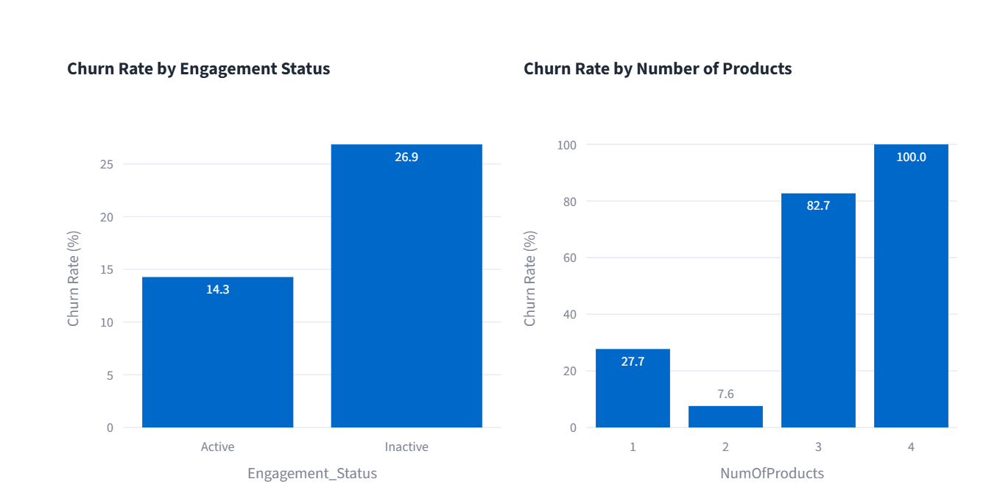
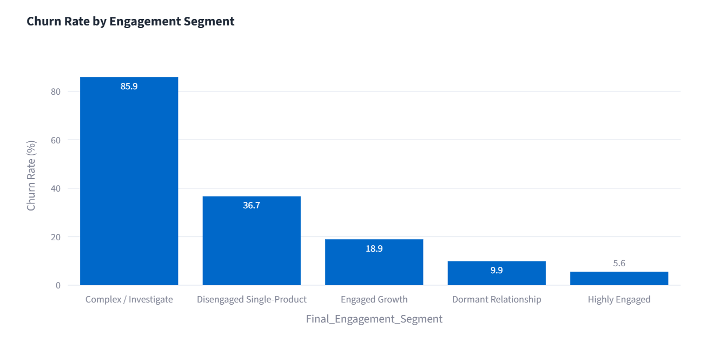
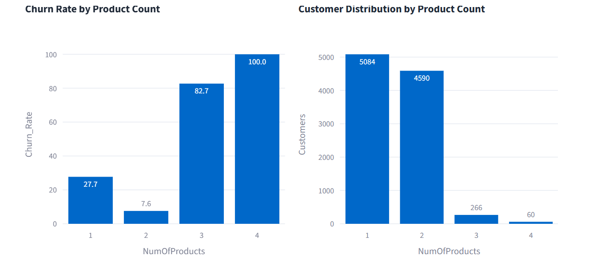
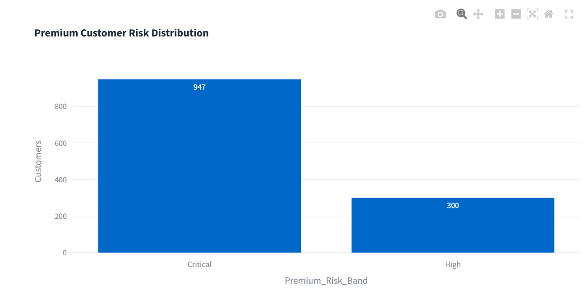
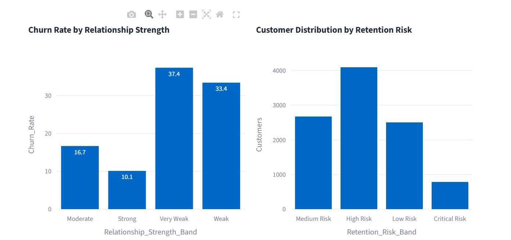

# Customer Engagement & Product Utilization Analytics for Retention Strategy

[](https://www.python.org/)
[](https://streamlit.io/)
[](https://github.com/preharendra/Customer_Engagement_Retention_Analytics)

## 🚀 Live Dashboard

**[Open the live Streamlit dashboard](https://customerengagementretentionanalytics.streamlit.app)**

## 📌 Project Overview

This project analyzes customer engagement, product utilization, financial commitment, and relationship strength to identify retention risks and support targeted banking retention strategies.

The project goes beyond generic churn prediction by answering three core business questions:

1. Does customer engagement relate to churn?
2. Does product relationship depth strengthen retention?
3. Which financially valuable customers are disengaged and therefore at risk?

## 🎯 Business Problem

Banks can have extensive customer data without a practical framework for connecting customer activity, product depth, and financial value to retention action. Generic retention campaigns can waste resources on customers who are already strongly attached while missing valuable customers whose engagement is declining.

This project creates a customer-level behavioral and relationship-strength framework for prioritizing retention actions.

## 🎯 Project Objectives

- Evaluate engagement versus churn.
- Measure product depth versus retention.
- Identify high-balance inactive customers.
- Develop a Relationship Strength Index.
- Develop a retention-risk scoring framework.
- Build an interactive Streamlit decision-support application.
- Translate analytical findings into retention, reactivation, and cross-sell strategies.

## 📊 Dataset

The analysis uses **10,000 banking customer records** and **14 original variables**, including `CustomerId`, `CreditScore`, `Geography`, `Gender`, `Age`, `Tenure`, `Balance`, `NumOfProducts`, `HasCrCard`, `IsActiveMember`, `EstimatedSalary`, and `Exited`.

Data validation confirmed **0 missing values, 0 duplicate rows, and 0 duplicate Customer IDs**.

## 🔄 Analytical Workflow

```text
Raw Banking Data
      ↓
Data Validation
      ↓
Cleaning & Feature Engineering
      ↓
Exploratory Data Analysis
      ↓
Engagement Segmentation
      ↓
Financial Commitment vs Engagement
      ↓
Relationship Strength & Retention Scoring
      ↓
Statistical Validation
      ↓
Final Business Insights
      ↓
Streamlit Decision-Support Dashboard
```

## 📚 Notebook Structure

| Notebook | Purpose |
|---|---|
| `01_Data_Validation.ipynb` | Data loading and quality validation |
| `02_Data_Cleaning_Feature_Engineering.ipynb` | Cleaning and business feature creation |
| `03_EDA.ipynb` | Exploratory customer and churn analysis |
| `04_Engagement_Segmentation.ipynb` | Engagement and engagement × product analysis |
| `05_Financial_Commitment_vs_Engagement.ipynb` | High-value and disengagement analysis |
| `06_Relationship_Strength_Retention_Scoring.ipynb` | Relationship Strength Index and risk scoring |
| `07_Statistical_Validation.ipynb` | Hypothesis tests and effect sizes |
| `08_Final_Insights_Business_Recommendations.ipynb` | Executive insights and recommendations |

## 🔎 Key Analytical Results

| Metric | Result |
|---|---:|
| Total customers analyzed | **10,000** |
| Overall churn | **20.37%** |
| Active customer churn | **14.27%** |
| Inactive customer churn | **26.85%** |
| One-product churn | **27.71%** |
| Two-product churn | **7.58%** |
| High-value disengaged customers | **1,247** |
| High-value disengaged churn | **30.47%** |

### Key Interpretation

- Customer inactivity is associated with materially higher churn than active membership.
- Two-product customers show substantially lower observed churn than one-product customers.
- Three-product and four-product customers show unusually high observed churn and therefore require diagnostic investigation rather than a simplistic “more products = more loyalty” conclusion.
- High-balance inactive customers represent an important premium-retention segment.
- Financial value alone does not guarantee customer loyalty.

## 👥 Customer Strategy Framework

| Segment | Business Meaning | Recommended Strategy |
|---|---|---|
| Strong Relationship | Strong engagement and relationship depth | Retain, reward, and strengthen loyalty |
| Growth Opportunity | Active but limited product depth | Need-based cross-sell |
| Disengaged | Weak customer activity | Reactivation and engagement campaigns |
| At-Risk Premium | High financial value with weak engagement | Priority proactive retention |
| Complex / Investigate | 3+ products with abnormal observed churn | Investigate product and service drivers |

## 🖥️ Streamlit Dashboard

The application contains five modules.

### 1. Executive Overview

High-level KPIs, engagement trends, product trends, and executive interpretation.

### 2. Engagement Analytics

Engagement segmentation, churn by behavioral profile, and engagement × product analysis.

### 3. Product Utilization

Product-count analysis, relationship-depth trends, and 3+ product diagnostics.

### 4. High-Value Customer Detector

Interactive identification of high-balance inactive customers and downloadable premium-customer watchlists.

### 5. Retention Strength & Risk

Relationship Strength Index, retention-risk bands, customer scorecards, and recommended retention strategies.

## 📸 Dashboard Preview

### 1. Executive Overview



### 2. Engagement Analytics



### 3. Product Utilization



### 4. High-Value Customer Detector



### 5. Retention Strength & Risk



## 🧪 Statistical Validation

The project uses:

- Chi-square tests for categorical relationships with churn.
- Cramér's V for categorical effect size.
- Mann-Whitney U tests for numerical comparisons.
- Point-biserial correlation for continuous score versus binary churn.
- Multiple-testing consideration for categorical hypothesis tests.

Statistical significance uses **α = 0.05**. Results are interpreted as associations rather than causal effects.

## 🧩 Technology Stack

- Python
- Pandas
- NumPy
- SciPy
- Matplotlib
- Seaborn
- Plotly
- Streamlit
- Jupyter Notebook
- Git / GitHub

## 🗂️ Project Structure

```text
Customer_Engagement_Retention_Analytics/
├── .streamlit/
│   └── config.toml
├── app/
│   └── app.py
├── data/
│   └── European_Bank_Final_Analytics_Dataset.csv
├── notebooks/
│   ├── 01_Data_Validation.ipynb
│   ├── 02_Data_Cleaning_Feature_Engineering.ipynb
│   ├── 03_EDA.ipynb
│   ├── 04_Engagement_Segmentation.ipynb
│   ├── 05_Financial_Commitment_vs_Engagement.ipynb
│   ├── 06_Relationship_Strength_Retention_Scoring.ipynb
│   ├── 07_Statistical_Validation.ipynb
│   └── 08_Final_Insights_Business_Recommendations.ipynb
├── outputs/
├── screenshots/
├── .gitignore
├── README.md
└── requirements.txt
```

## ▶️ Run Locally

```bash
git clone https://github.com/preharendra/Customer_Engagement_Retention_Analytics.git
cd Customer_Engagement_Retention_Analytics
pip install -r requirements.txt
streamlit run app/app.py
```

## 🚀 Deployment

The Streamlit application is deployed through Streamlit Community Cloud.

**Entrypoint:** `app/app.py`

**Live URL:** https://customerengagementretentionanalytics.streamlit.app

## 💼 Business Value

The solution supports:

- Engagement-driven retention.
- Premium customer protection.
- Product bundling decisions.
- Cross-sell prioritization.
- Customer reactivation.
- Risk-based allocation of retention resources.

## 🔮 Future Scope

- Explainable machine-learning churn prediction.
- Product-combination and product-level journey analysis.
- Customer lifetime value estimation.
- CRM and campaign-response integration.
- A/B testing of retention interventions.
- Automated high-risk customer alerts.

## 📦 Deliverables

### 📄 Research Paper
-[Download Research Paper (PDF)](docs/Research_Paper.pdf)

-[Download Research Paper (DOCX)](docs/Research_Paper.docx)

### 📊 Executive Summary
-[Download Executive Summary (PDF)](docs/Executive_Summary.pdf)

-[Download Executive Summary (DOCX)](docs/Executive_Summary.docx)
### 🚀 Live Streamlit Dashboard
- [Live Streamlit Dashboard](https://customerengagementretentionanalytics.streamlit.app)

## 👤 Author

**Harendra**  
MBA (Business Analytics)  
Business Analytics | Finance & Operations Analytics

## ⚠️ Disclaimer

This is an academic/portfolio analytics project. Findings are based on the analyzed dataset and should be validated with longitudinal customer behavior, product-level data, and controlled retention interventions before operational deployment.
